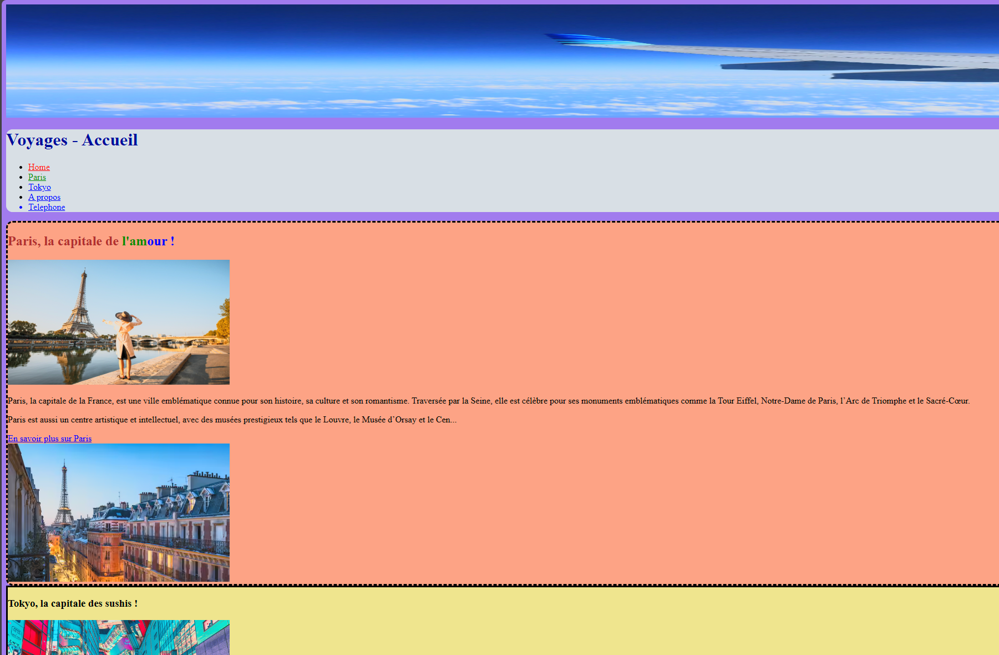

<h1 align="center">Welcome to Voyages-Touktouk 👋</h1>

  

# Création d'un site de voyage Touktouk

## Utilisation du langage HTML et CSS

  

### Cliquer sur le lien ci-dessous pour visualiser le projet :

### ✨ [Demo](https://dev-it-seb.github.io/Voyages-Touktouk/)

## Author

👤 **Sebastien C.**

* Github: [@Dev-IT-Seb](https://github.com/Dev-IT-Seb)

## Show your support

Give a ⭐️ if this project helped you!

***
_This README was generated with ❤️ by [readme-md-generator](https://github.com/kefranabg/readme-md-generator)_